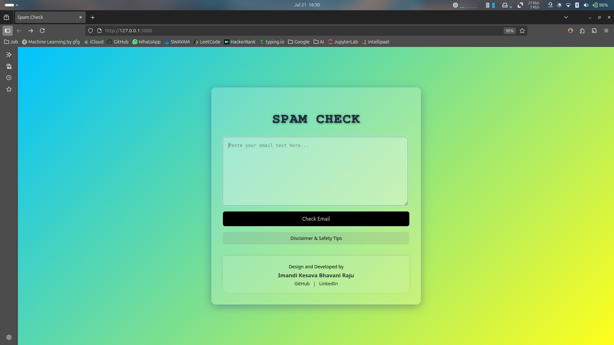

# 📧 Spam Email Detection Web App

A modern **Spam Email Detection** web application that classifies emails as **SPAM** or **HAM** using Machine Learning.
The project is built using **Python, Flask, Scikit-learn, MySQL, HTML, CSS, and JavaScript** with a clean and responsive glassmorphic UI.

---



---

## 🚀 Features

* Detect whether an email is **Spam** or **Ham**
* Displays prediction confidence score
* Interactive progress bar UI
* Stores predictions in MySQL database
* Consent popup for user awareness
* Privacy disclaimer page
* Modern glassmorphic frontend design

---

## 🛠️ Technologies Used

* Python
* Flask
* Scikit-learn
* MySQL
* HTML5
* CSS3
* JavaScript

---

## 📁 Project Structure

```bash
Email-Spam-Detection/
│
├── data/
│   ├── ham/
│   └── spam/
│
├── database/
│   └── schema.sql
│
├── models/
│   ├── spam_model.pkl
│   ├── vectorizer.pkl
│   └── backup/
│       ├── spam_model.pkl
│       └── vectorizer.pkl
│
├── notebooks/
│   └── spam_detection.ipynb
│
├── static/
│   └── style.css
│
├── templates/
│   ├── index.html
│   └── disclaimer.html
│
├── app.py
├── requirements.txt
└── README.md
```

---

## ⚙️ Installation & Setup

### 1. Install Dependencies

```bash
pip install -r requirements.txt
```

---

### 2. Setup MySQL Database

Create Database:

```sql
CREATE DATABASE spam_checker;
```

Create Table:

```sql
USE spam_checker;

CREATE TABLE predictions (
    id INT AUTO_INCREMENT PRIMARY KEY,
    email_body TEXT,
    label VARCHAR(10),
    confidence FLOAT
);
```

---

### 3. Configure Database Connection

Update your database credentials inside `app.py`:

```python
db = mysql.connector.connect(
    host="localhost",
    user="YOUR_USERNAME",
    password="YOUR_PASSWORD",
    database="spam_checker"
)
```

---

### 4. Run the Flask Application

```bash
python app.py
```

---

### 5. Open in Browser

```bash
http://localhost:5000
```

---

## 📊 Machine Learning Workflow

1. Data Collection
2. Text Preprocessing
3. Feature Extraction using TF-IDF
4. Model Training
5. Spam Prediction
6. Database Storage

---

## 🔮 Future Improvements

* Add Deep Learning models
* Deploy on cloud platform
* User authentication system
* Email API integration
* Real-time spam filtering

---

## 👨‍💻 Author

**Anmol Kankarwal**
B.Tech CSE (AI) Student
Galgotias University

* GitHub: https://github.com/Anmolkankarwal

---
